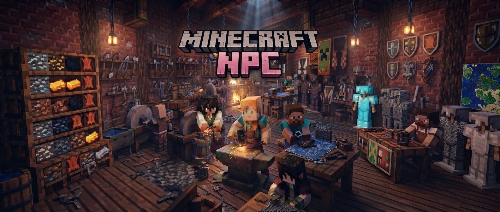

> **This mod adds multiple shops and a currency system to your Minecraft Bedrock world**

---

# ShopKeeper Mod

A custom shop NPC addon for Minecraft Bedrock 1.21.130. Place friendly shopkeepers in your world — hit them to open their villager-style shop screen and trade items.

## Meet the Shopkeepers

| NPC | Role | Identifier |
|-----|------|------------|
| William Roger | GoldSmith | `david:gold_smith` |
| Valerina | Fruit Seller | `david:valerina` |
| Tim | Lumberjack (Timber Jack) | `david:timber_jack` |
| Maggie | Farmer | `david:farmer_maggie` |
| Lily | Florist | `david:florist_lily` |
| Sage | Herbalist | `david:herbalist_sage` |
| Petra | Mason | `david:mason_petra` |
| Rosa | Rancher | `david:rancher_rosa` |
| Finn | Fisherman | `david:fisherman_finn` |
| Dana | Diver | `david:diver_dana` |
| Freddie | Brewer | `david:brewer_freddie` |
| Maya | Mystic | `david:mystic_maya` |
| Chester | Collector | `david:collector_chester` |
| Tessa | Trader | `david:trader_tessa` |

## How to Use
1. Import the addon (both Behavior + Resource packs)
2. Enable **Holiday Creator Features** experiment
3. Summon a shopkeeper, e.g. `/summon david:gold_smith`
4. **Hit** the NPC to open its shop
5. Trade items between the shopkeeper and your inventory

## Summon Commands
- GoldSmith: `/summon david:gold_smith`
- Fruit Seller: `/summon david:valerina`
- ... and so on for each NPC identifier above

## Features
- 14 unique shopkeeper NPCs
- Native villager trade system (scrollable item list)
- Custom skins for each NPC
- Currency-based trading economy
- Works on mobile (PE) and desktop Bedrock

## Requirements
- Minecraft Bedrock Edition 1.21.130+
- Holiday Creator Features experiment ON

## Credits
- **Made by david**
- Shop NPCs and trading by david

## Version
- **v1.0.7** — ShopKeeper Mod with 14 NPCs & villager-style trading
